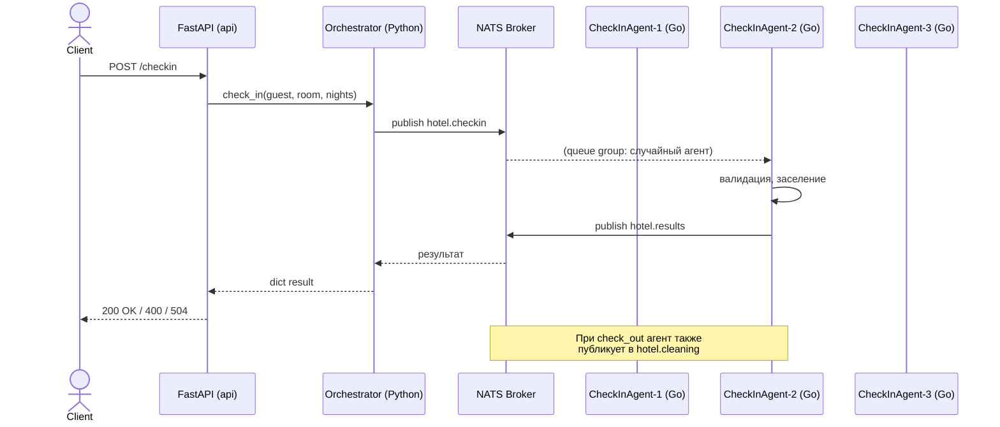
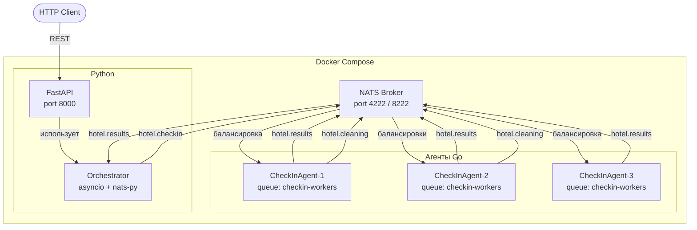

```mermaid
sequenceDiagram
    actor Client
    participant API as FastAPI (api)
    participant Orch as Orchestrator (Python)
    participant NATS as NATS Broker
    participant A1 as CheckInAgent-1 (Go)
    participant A2 as CheckInAgent-2 (Go)
    participant A3 as CheckInAgent-3 (Go)

    Client->>API: POST /checkin
    API->>Orch: check_in(guest, room, nights)
    Orch->>NATS: publish hotel.checkin
    NATS-->>A2: (queue group: случайный агент)
    A2->>A2: валидация, заселение
    A2->>NATS: publish hotel.results
    NATS-->>Orch: результат
    Orch-->>API: dict result
    API-->>Client: 200 OK / 400 / 504

    Note over A2,NATS: При check_out агент также<br/>публикует в hotel.cleaning
```

```mermaid
graph TD
    subgraph Docker Compose
        NATS[NATS Broker<br/>port 4222 / 8222]

        subgraph Агенты Go
            CA1[CheckInAgent-1<br/>queue: checkin-workers]
            CA2[CheckInAgent-2<br/>queue: checkin-workers]
            CA3[CheckInAgent-3<br/>queue: checkin-workers]
        end

        subgraph Python
            ORCH[Orchestrator<br/>asyncio + nats-py]
            API[FastAPI<br/>port 8000]
        end
    end

    Client([HTTP Client]) -->|REST| API
    API -->|использует| ORCH
    ORCH -->|hotel.checkin| NATS
    NATS -->|балансировка| CA1
    NATS -->|балансировки| CA2
    NATS -->|балансировка| CA3
    CA1 -->|hotel.results| NATS
    CA2 -->|hotel.results| NATS
    CA3 -->|hotel.results| NATS
    NATS -->|hotel.results| ORCH
    CA1 -->|hotel.cleaning| NATS
    CA2 -->|hotel.cleaning| NATS
```
